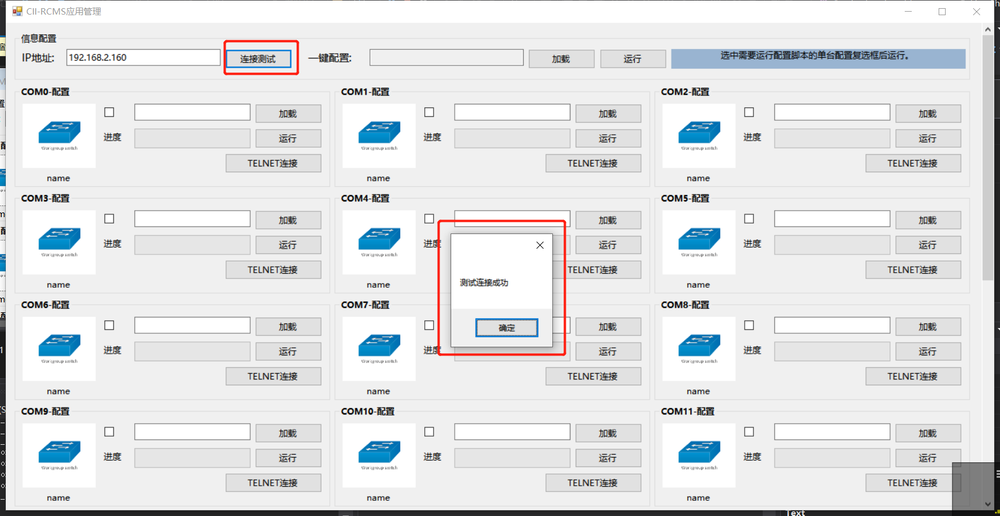
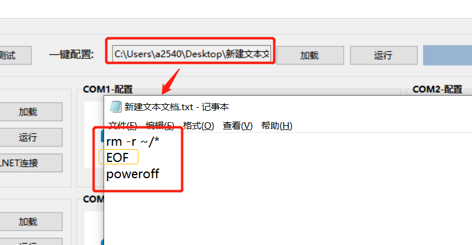
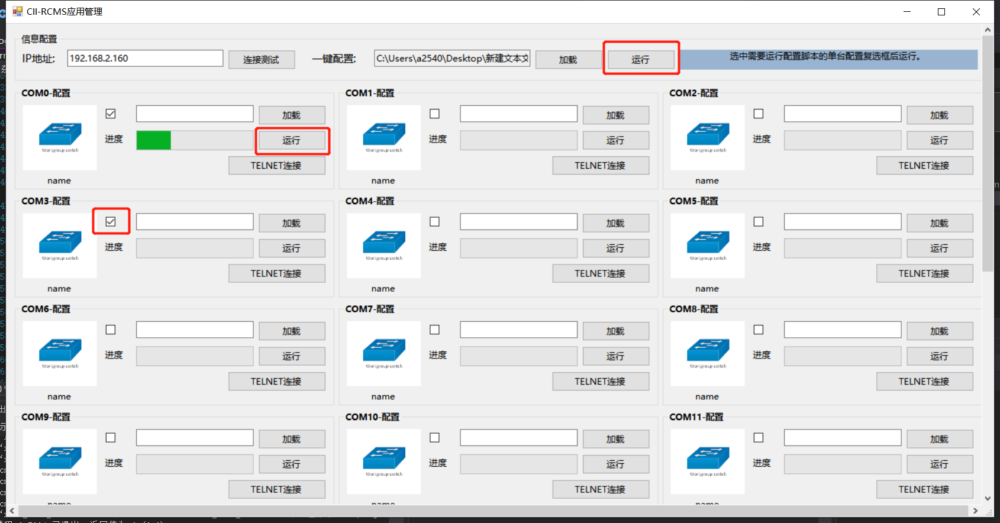
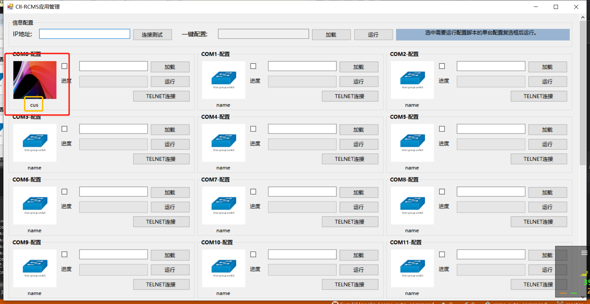
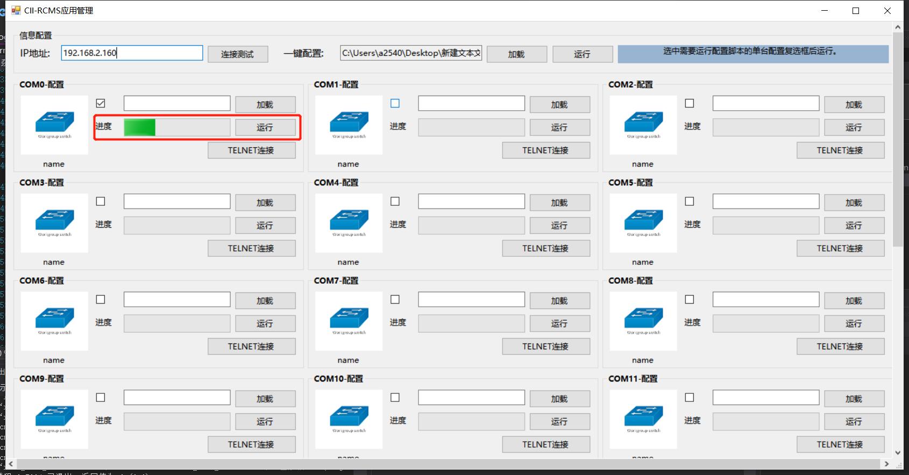
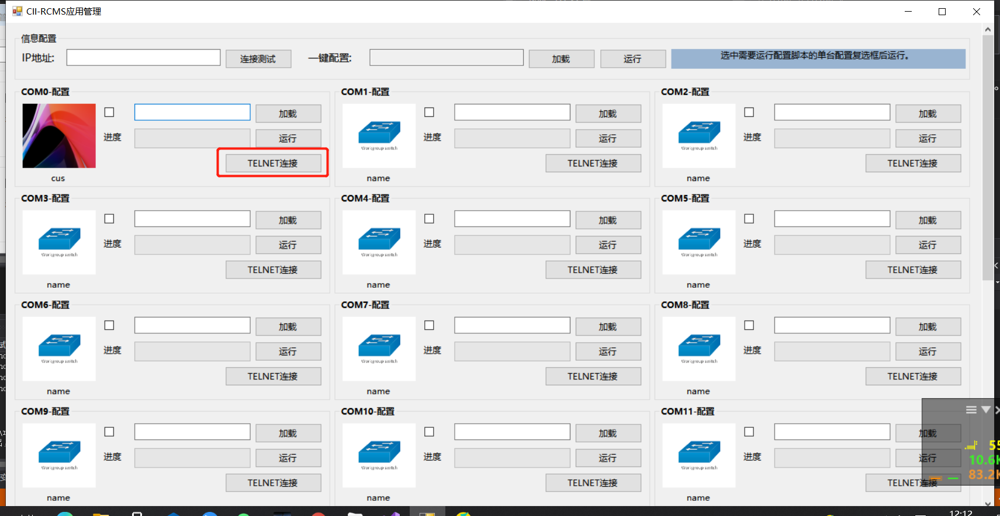
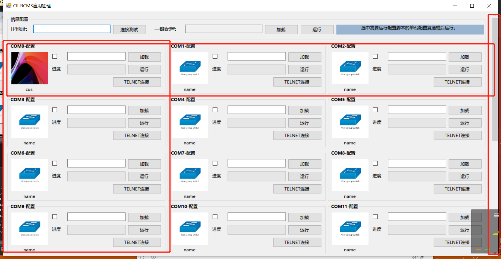

# CII-RCMS AUTO COMMAND

专为 **CII-RCMS** 而设计的批量命令下发工具。

## 概述

本工具可批量对 **CII-RCMS** 设备所连接的 **24** 个CONSOLE口进行 **批量** 或 **单独** 的命令下发操作。

## 功能介绍

### 连接测试

该功能可测试与 **CII-RCMS** 的通信是否正常。

### 加载命令集

该功能允许用户以文本文档的形式存储命令集，不限行数，且提供了强制断开的EOF指令。极大的方便了技术人员的运维需求。

### 单独或批量命令下发

当命令集配置完毕后，用户可选择需要进行下发的设备，一键或单独下发命令集。

### 个性化

用户可对各个COM口进行个性化设置，重命名或更换设备图片。退出时自动保存相关配置文件，打开时自动加载。

### 进度实时反馈

当执行命令下发时，相关设备会实时返回命令执行的进度。

### 一键TELNET连接

在每个COM口的控制区块下，都可进行一键TELNET连接。技术人员无需再使用命令终端，减少时间及精力损耗。

### 多列显示

本工具将控制区块分为 **8行x3列** 制，用户可以方便的对多控制区块进行控制。

